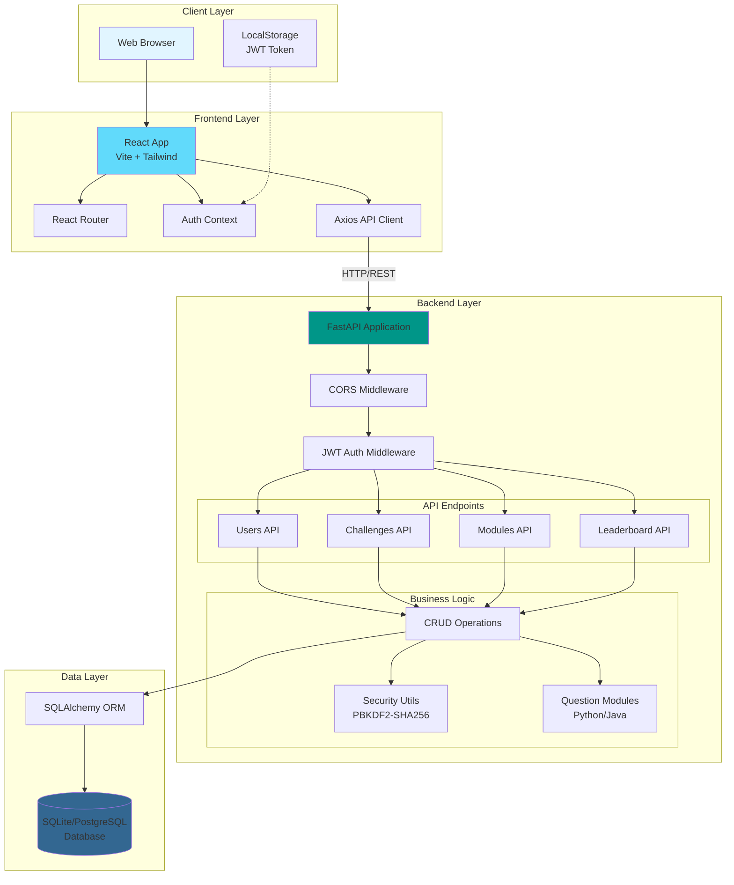
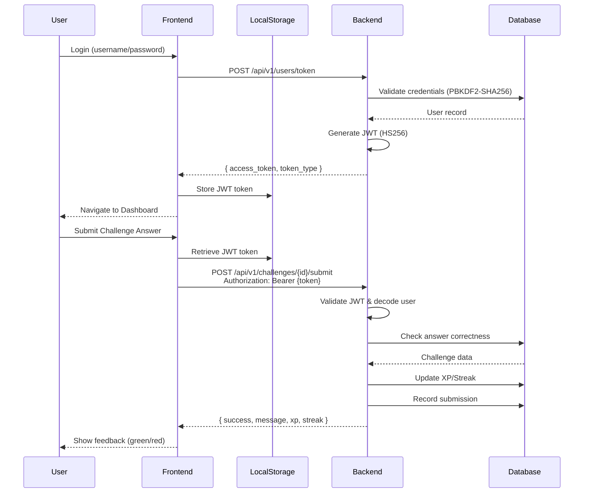
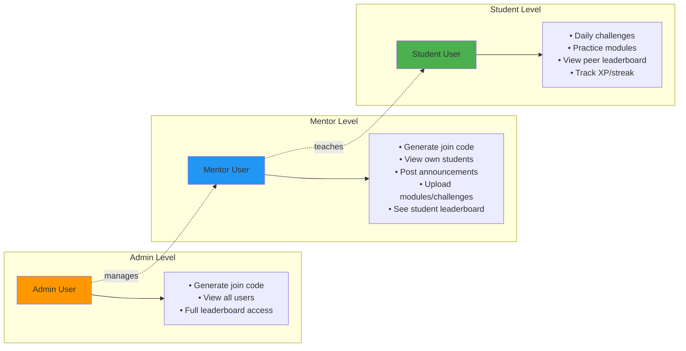
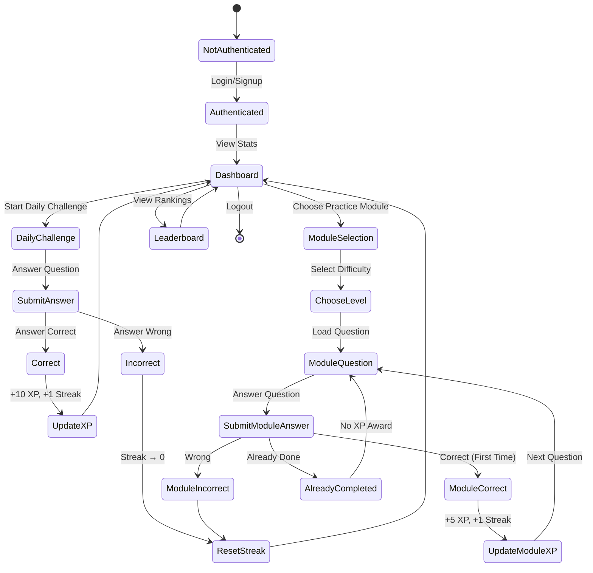

# SkillSprint
# SkillSprint — 30‑Day Challenges + Practice Modules

SkillSprint is a gamified micro‑learning platform. Users complete short daily challenges to build a learning habit, and can also practice anytime via “Modules” (Python, Java) with beginner/intermediate/expert levels.

## Highlights
- Daily challenges with instant feedback, XP, and streaks
- Practice Modules (Python, Java) you can access anytime
- Sequential question flow with a clickable carousel to jump to any question
- Color feedback on submit (green = correct, red = incorrect)
- Completed items visually marked in the carousel
- JWT authentication; leaderboard; dark/light theme
- Modern UI with glass cards, hover/scale, and soft shadows

---

## Tech Stack
- Frontend: React (Vite), Tailwind CSS, Axios, React Router
- Backend: FastAPI, Uvicorn, SQLAlchemy, Pydantic, passlib, python‑jose (JWT)
- DB: SQLite for development (swap to PostgreSQL for production)
- Tests/Tooling: Pytest, npm scripts, dotenv-style config

---

## System Architecture

### Architecture Diagram



### Component Interaction Flow



---

## Use Case Diagrams

### User Roles and Interactions

```mermaid
graph TB
    subgraph "Actors"
        Student[👨‍🎓 Student]
        Mentor[👨‍🏫 Mentor]
        Admin[👨‍💼 Admin]
        Guest[👤 Guest]
    end
    
    subgraph "Authentication Use Cases"
        UC1[Sign Up]
        UC2[Login]
        UC3[Logout]
        UC4[Generate Join Code]
    end
    
    subgraph "Learning Use Cases"
        UC5[View Daily Challenge]
        UC6[Submit Answer]
        UC7[Practice Modules]
        UC8[Choose Difficulty Level]
        UC9[Track Progress]
    end
    
    subgraph "Social Use Cases"
        UC10[View Leaderboard]
        UC11[Check Streak]
        UC12[Monitor XP]
    end
    
    subgraph "Management Use Cases"
        UC13[View My Students]
        UC14[Post Announcement]
        UC15[Upload PDF Module]
        UC16[Bulk Upload Challenges]
        UC17[Manage All Users]
        UC18[View Full Leaderboard]
    end
    
    Guest --> UC2
    
    Student --> UC1
    Student --> UC2
    Student --> UC3
    Student --> UC5
    Student --> UC6
    Student --> UC7
    Student --> UC8
    Student --> UC9
    Student --> UC10
    Student --> UC11
    Student --> UC12
    
    Mentor --> UC1
    Mentor --> UC2
    Mentor --> UC3
    Mentor --> UC4
    Mentor --> UC10
    Mentor --> UC13
    Mentor --> UC14
    Mentor --> UC15
    Mentor --> UC16
    
    Admin --> UC2
    Admin --> UC3
    Admin --> UC4
    Admin --> UC17
    Admin --> UC18
    
    style Student fill:#4CAF50
    style Mentor fill:#2196F3
    style Admin fill:#FF9800
    style Guest fill:#9E9E9E
```



### Role-Based Access Control



### Learning Flow Use Case



---

## Project Structure (high level)
```
skillsprint/
├─ backend/
│  ├─ app/
│  │  ├─ api/
│  │  │  └─ v1/… (routers: challenges, users, modules, etc.)
│  │  ├─ modules/
│  │  │  ├─ questions.py         # Python module questions (60)
│  │  │  └─ java_questions.py    # Java module questions (60)
│  │  ├─ models.py               # SQLAlchemy models (User, Submission, ModuleProgress…)
│  │  ├─ schemas.py              # Pydantic schemas
│  │  ├─ crud.py                 # DB helpers
│  │  ├─ security.py             # JWT/password utilities
│  │  └─ main.py                 # FastAPI app + CORS
│  ├─ seed.py                    # Seed daily challenges
│  └─ requirements.txt
└─ frontend/
   ├─ src/
   │  ├─ pages/
   │  │  ├─ Home.jsx
   │  │  ├─ Modules.jsx          # Module landing (Python, Java cards)
   │  │  ├─ ModulePython.jsx     # Choose level (Python)
   │  │  ├─ ModuleJava.jsx       # Choose level (Java)
   │  │  └─ ModuleLevel.jsx      # Sequential quiz + carousel + feedback
   │  ├─ components/…            # Header, cards, etc.
   │  ├─ services/api.js         # Axios API client
   │  └─ index.css               # Tailwind + shared card styles
   └─ vite.config.js
```

---

## Features in Detail

### Daily Challenges
- 30 days of bite‑sized questions across categories
- Correct answer: awards XP and maintains streak
- Leaderboard shows top users

### Practice Modules (Python, Java)
- Levels: beginner, intermediate, expert (20 questions each)
- Sequential flow (one question at a time)
- Carousel to jump to any question (1..N)
  - Completed questions are visually marked
- Instant correctness check:
  - Correct: +5 XP and +1 streak (per unique question)
  - Wrong: streak resets (same as daily rules)
  - Duplicate correct submissions don’t re‑award XP
- Friendly matching: trims whitespace, ignores case, strips quotes, and supports per‑question variants

### UI/Design
- Consistent “ChallengeCard” look across the app
- Glassy cards, rounded corners, hover scale and lift, rich shadows
- Dark/light theme; animated gradient background
- Inputs with improved focus and contrast

---

## Environment Variables

Backend (suggested)
- SECRET_KEY
- ACCESS_TOKEN_EXPIRE_MINUTES (e.g., 60)
- DATABASE_URL (defaults to SQLite; use PostgreSQL in production)
- CORS origins (list of allowed frontend URLs)

Frontend
- VITE_API_URL (defaults to http://127.0.0.1:8000)

---

## API Overview (selected)

- Auth
  - POST /api/v1/users/token (JWT)
  - GET  /api/v1/users/me

- Daily challenges
  - GET  /api/v1/challenges/
  - POST /api/v1/challenges/submit

- Modules (module in {python, java}, level in {beginner, intermediate, expert})
  - GET  /api/v1/modules/{module}/{level}
    - Returns: id, level, question, explanation, completed
  - POST /api/v1/modules/{module}/{level}/submit
    - Body: { id, answer }
    - Correct: +5 XP, +1 streak; Wrong: streak reset
    - Prevents double XP for same user+question

Note: Python-only routes remain for back-compat:
- GET  /api/v1/modules/{level}
- POST /api/v1/modules/{level}/submit

---

## Data Model (key tables)
- User: credentials, XP, streak
- Challenge: daily question bank
- Submission: historical user submissions
- ModuleProgress: completed module questions per user (prevents duplicate XP)

---

## Seeding (daily challenges)
```powershell
# From backend/
.\venv\Scripts\Activate.ps1
python seed.py
```

---

## Testing
```powershell
# From backend/
.\venv\Scripts\Activate.ps1
python -m pytest -q
```

---

## Troubleshooting

- CORS error in browser console
  - Ensure backend CORS allows http://localhost:5173
  - Restart backend after changes

- 401 Unauthorized
  - Log in, include Authorization: Bearer <token> for protected routes

- Frontend can’t reach API
  - Check VITE_API_URL and backend port/host

---

## Production Notes
- Replace SQLite with PostgreSQL + Alembic migrations
- Add rate limiting, robust logging, and HTTPS
- Frontend: build with `npm run build` and deploy static files
- Backend: deploy FastAPI behind a reverse proxy

---

## Contributing
- Use feature branches and conventional commits
- Run backend tests before PRs
- Keep questions/answers consistent and add variants for user-friendly matching

